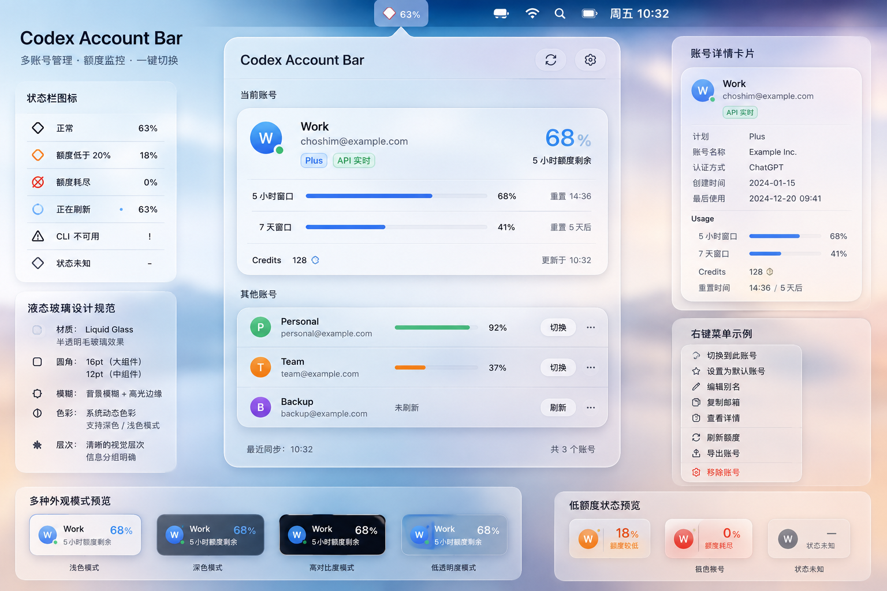
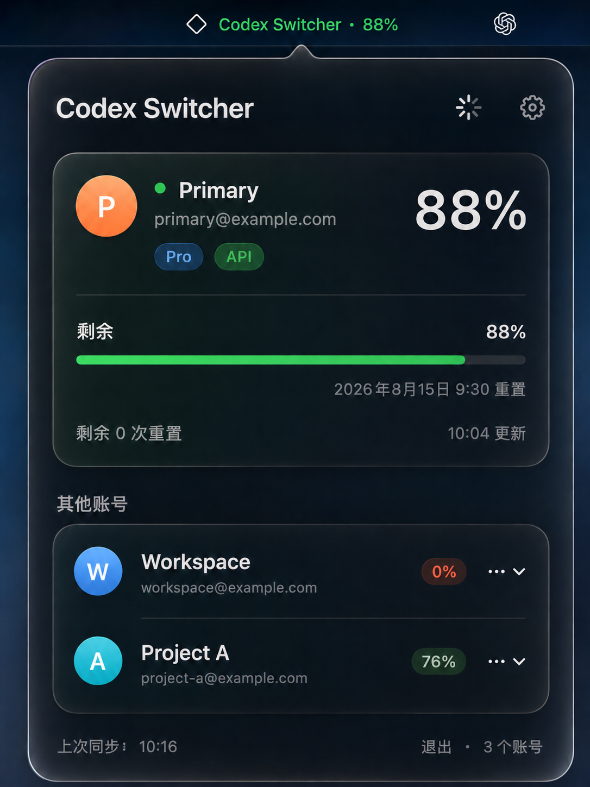

# CodexSwitcher

`CodexSwitcher` 是 `codex-auth` 的原生 macOS 菜单栏伴侣应用，基于 SwiftUI 与 Liquid Glass 设计系统构建。



## 功能概览

- **菜单栏状态** — 菜单栏常驻显示当前活跃账号名与用量百分比，状态一目了然。
- **账号面板** — 点击菜单栏图标展开悬浮面板，展示当前账号详情、用量进度条、其他账号列表。
- **一键切换** — 从其他账号列表直接切换活跃账号，支持切换前确认提醒。
- **用量追踪** — 直观显示各账号的主/次用量窗口、剩余百分比、额度重置时间。
- **API / 本地双刷新** — 支持 API 实时刷新与离线本地刷新；数据来源清晰标注。
- **深浅色模式** — Liquid Glass 毛玻璃表面 + 自适应深浅色方案，原生 macOS 视觉体验。
- **后台定时刷新** — 每 5 分钟自动刷新账号状态。

## 产品需求与 JSON 接口

产品需求文档和 JSON 契约边界定义在父仓库的：

- [macOS 菜单栏应用需求文档](../../docs/macos-status-bar-app-requirements.md)
- [JSON API 文档](../../docs/json-api.md)

CodexSwitcher **不直接操作** `~/.codex` 账号存储；所有读写均通过 `codex-auth` CLI 的结构化 `--json` 接口完成。

## 安装

从 [Releases](../../release/) 页面下载最新的 `CodexSwitcher-*.dmg`，将 `CodexSwitcher.app` 拖入 `Applications` 文件夹即可。

> **依赖**：需要已安装 `codex-auth` CLI（`npm install -g @loongphy/codex-auth`），否则应用将显示 CLI 不可用的引导提示。

## 界面说明

### 主面板


点击菜单栏图标弹出悬浮面板，包含三个区域：

1. **顶部栏** — 应用标题 "Codex Switcher" + 刷新按钮。刷新时显示进度状态。
2. **当前账号卡片** — 头像（首字母 + 渐变色）、别名、邮箱、Plan 徽章（Plus / Pro / Free）、数据来源徽章（API / Local / Cache / Offline）、剩余百分比大字号显示、主/次用量进度条、额度信息、更新时间。
3. **其他账号列表** — 每个账号显示头像、别名、邮箱、用量百分比徽章、`⋯` 操作菜单（切换账号 / 复制邮箱 / 移除账号）。

底部栏显示最近同步时间和账号总数，以及退出按钮。

### 设置



通过菜单栏图标 → Settings 进入设置面板：

- **Low Capacity Threshold** — 低容量警告阈值（默认 20%，可调；0% 始终为严重状态）
- **Confirm before switching** — 切换前是否弹出确认对话框
- **Codex Auth Path** — 自定义 `codex-auth` 可执行文件路径（默认从 PATH 发现）
- **Launch at login** — 登录时自动启动

## 状态语义

| 状态 | 触发条件 | 表现 |
|------|----------|------|
| 正常 | 主用量可用且高于警告阈值 | 蓝色/语义色强调，正常图标 |
| 低容量 | 剩余容量低于阈值（默认 20%） | 橙色警告图标 + 橙色强调色 |
| 已耗尽 | 剩余容量为 0% | 红色严重图标 + 红色强调色 |
| 刷新中 | 正在执行读取命令 | 进度指示器，保留上次快照 |
| CLI 不可用 | 找不到或无法启动 CLI | 警告状态，显示引导提示 |
| 无用量数据 | `usage.source` 为 `none` | 显示未知状态符号 |
| 状态不确定 | CLI 返回 `state_uncertain` | 锁定操作控件，需先刷新 |

颜色为辅助信息；每种状态同时配有图标和无障碍文本。

## 项目结构

```
Sources/CodexSwitcher/
├── App/                    # 应用入口 + 场景组合
│   ├── CodexSwitcherApp.swift
│   └── MenuBarController.swift
├── DesignSystem/           # Liquid Glass 设计系统
│   ├── DesignTokens.swift  # 视觉令牌：颜色、间距、圆角、字体、尺寸
│   ├── L10n.swift          # 本地化字符串
│   ├── LiquidGlassCardModifier.swift
│   └── QuotaStyle.swift    # 用量状态语义
├── Features/
│   ├── MenuBar/            # 菜单栏 + 悬浮面板
│   │   ├── MenuBarPopoverView.swift   # 面板主布局
│   │   ├── MenuBarStore.swift         # 状态管理 (@Observable)
│   │   ├── PopoverHeaderView.swift    # 顶部栏
│   │   ├── CurrentAccountCard.swift   # 当前账号卡片
│   │   ├── AccountRowView.swift       # 其他账号行
│   │   └── UsageProgressRow.swift     # 用量进度条
│   └── Settings/
│       └── SettingsView.swift
├── Infrastructure/         # CLI 进程客户端
│   ├── CLIProcessService.swift
│   └── AccountMapper.swift
└── Models/                 # JSON 契约模型
    ├── CLIResponseModels.swift
    └── CodexAccount.swift
```

## 构建

```shell
cd apps/CodexSwitcher
swift build
```

或通过 Xcode：

```shell
open Package.swift
```

要求 macOS 15+、Swift 6.0。

## 打包与分发

构建和签名脚本位于 `Scripts/` 目录：

```shell
cd apps/CodexSwitcher
./Scripts/build-all.sh    # 构建 Release 版本
./Scripts/package.sh      # 打包为 DMG（需签名凭证）
```

DMG 输出至 `release/` 目录。

## 许可

同父项目 [LICENSE](../../LICENSE)。
